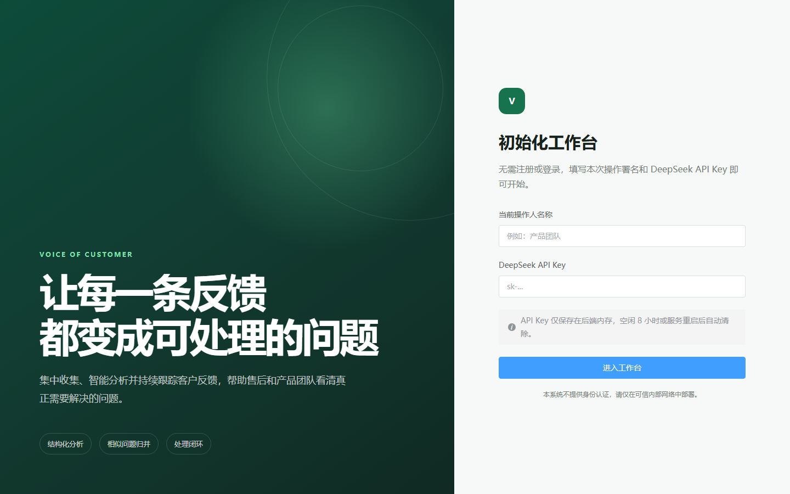

# VoC Insight

[](https://github.com/jinjian-liu/voc-insight/releases/latest)
[](https://github.com/jinjian-liu/voc-insight/releases/latest/download/VoC-Insight-Windows-x64.exe)
[](#本地开发)

> 让散落在工单、聊天和表格里的客户声音，真正变成可以被看见、被处理、被解决的问题。

VoC Insight 是一款面向售后与产品团队的轻量级客户反馈智能分析工具。它使用 DeepSeek 将非结构化反馈自动整理成摘要、分类、关键词、严重程度和处理优先级，再把多条反馈归并到可跟踪的标准问题中，形成从反馈收集到问题解决的完整闭环。

无需账号体系、无需复杂中间件、无需部署大型平台。下载 Windows EXE，填写自己的 DeepSeek API Key，即可开始体验。



## 为什么需要它

周一上午，售后群里接连出现几条消息：

> “昨天升级以后导出一直失败。”  
> “财务同事无法下载 Excel，对账被卡住了。”  
> “客户说点击导出没有任何反应，比较着急。”

这些反馈来自不同时间、不同渠道，表达方式也不相同。售后需要逐条整理，产品经理需要重新理解背景，管理者却仍然不知道：这是不是同一个问题？到底影响有多严重？谁已经处理过？类似反馈还在增加吗？

VoC Insight 会把它们转化为一个清晰、可执行的问题：

> **版本升级后 Excel 导出失败｜功能异常｜高严重度｜P1**  
> 已关联 3 条反馈，影响财务对账流程，缺少产品版本和报错信息。

团队不再停留在“收集了很多反馈”，而是能够看见真正需要解决的问题，并知道问题是否已经得到处理。

## 核心价值

- **把阅读变成确认**：AI 完成摘要、分类和影响判断，管理员只需校正结果。
- **把重复反馈变成影响证据**：相似反馈关联到同一问题，反馈数量不再被重复工单掩盖。
- **把口头跟进变成处理记录**：问题处理结果、操作人和时间线统一沉淀。
- **把数量统计变成管理视角**：看板突出待处理、高严重度和高频问题。
- **保持轻量与可控**：SQLite 单文件数据库、无登录、单机运行，API Key 不持久化。

## 功能一览

### 反馈管理

- 单条文本录入
- CSV/XLSX 批量导入
- 关键词、来源筛选与分页
- 反馈逻辑删除
- 导入限制：10 MB、单次最多 2,000 条

### AI 智能分析

- 问题摘要
- 自定义问题分类
- 子分类和关键词
- 情绪倾向
- 严重程度：低、中、高、紧急
- 建议优先级：P0—P3
- 用户影响描述
- 信息缺失提示
- 人工编辑、确认和重新分析

### 问题闭环

- 从分析结果创建标准问题
- 相似问题推荐
- 将反馈关联至已有问题
- 待处理/已处理状态
- 处理结果、处理者和处理时间
- 关联反馈与操作时间线
- 问题逻辑删除

### 数据看板与设置

- 反馈总量和待分析数量
- 待处理、已处理和高严重度问题
- 平均解决时间
- 反馈分类分布
- 问题状态分布
- 高频问题排行
- 自定义问题分类

## 3 分钟操作演示

### 1. 初始化本次工作会话

打开应用，填写：

- 当前操作人名称：仅用于处理者署名，不是账号或登录；
- DeepSeek API Key：只保存在后端进程内存中，空闲 8 小时、主动清除或关闭应用后失效。

### 2. 录入一条真实反馈

进入“反馈管理”，点击“录入反馈”，粘贴原始内容：

```text
昨天升级以后，导出的 Excel 一直提示失败，整个财务团队都没法对账。
```

保存后系统自动启动 AI 分析。

### 3. 检查并确认 AI 结果

分析完成后打开反馈详情。系统将给出类似结果：

```json
{
  "summary": "版本升级后无法导出 Excel",
  "category": "功能异常",
  "keywords": ["Excel", "导出失败", "版本升级"],
  "severity": "high",
  "suggested_priority": "P1",
  "user_impact": "财务团队无法完成日常对账",
  "information_missing": ["产品版本", "错误提示"]
}
```

管理员可以修改任何字段，然后点击“保存并确认分析”。

### 4. 关联已有问题或创建新问题

系统会根据摘要和分类推荐相似问题：

- 如果已有同类问题，点击“关联”；
- 如果是新问题，点击“创建问题”。

同一个问题关联的反馈越多，越容易在问题列表和高频问题排行中被发现。

### 5. 完成问题处理

进入“问题管理”，打开待处理问题，查看相关反馈和背景。填写解决方案后点击“提交并标记已处理”，系统自动记录：

- 处理结果；
- 当前操作人；
- 处理时间；
- 完整操作时间线。

### 6. 通过看板复盘

进入“数据看板”，查看分类分布、问题状态、高严重度问题、平均解决时间和高频问题排行，让下一次产品决策有数据依据。

## 业务流程


## Windows 下载体验

[直接下载 Windows EXE](https://github.com/jinjian-liu/voc-insight/releases/latest/download/VoC-Insight-Windows-x64.exe)，或前往 [GitHub Releases](https://github.com/jinjian-liu/voc-insight/releases/latest) 查看版本说明。

1. 双击运行 EXE，应用会在默认浏览器中打开；
2. 程序驻留在 Windows 系统托盘；
3. 右键托盘图标可重新打开工作台或安全退出。

业务数据保存在：

```text
%LOCALAPPDATA%\VoCInsight\voc.db
```

如遇启动问题，可查看运行日志：

```text
%LOCALAPPDATA%\VoCInsight\voc-insight.log
```

首次运行时 Windows SmartScreen 可能提示“未知发布者”，这是因为个人构建包没有购买代码签名证书。选择“更多信息 → 仍要运行”即可继续。

## 本地开发

### 环境

- Node.js 20+
- Python 3.11+
- DeepSeek API Key

### 启动后端

```powershell
cd backend
python -m venv .venv
.\.venv\Scripts\Activate.ps1
pip install -e ".[dev]"
uvicorn app.main:app --reload --port 8000
```

### 启动前端

```powershell
cd frontend
npm install
npm run dev
```

打开 `http://localhost:5173`。

### 构建 Windows EXE

```powershell
.\scripts\build_windows.ps1
```

输出文件：`release\VoC-Insight-Windows-x64.exe`。

## 技术架构

```text
Vue 3 + TypeScript + Element Plus + ECharts
                       ↓ REST API
FastAPI + SQLAlchemy + 进程内 AI 任务
                       ↓
              SQLite + DeepSeek API
```

- 前后端同源打包，EXE 运行时不需要额外安装 Node.js 或 Python；
- DeepSeek 使用 JSON Output，并通过 Pydantic 校验结构；
- 默认模型为 `deepseek-flash`，关闭思考模式以降低延迟和成本；
- 不引入 Redis、Celery、独立向量数据库或多租户架构。

## 隐私与使用边界

- 系统不保存客户档案、客户名称、联系人或客户等级；
- DeepSeek API Key 不写入数据库、文件或浏览器持久化存储；
- 本项目不提供登录和身份认证，只适合个人体验或可信内部网络；
- 使用真实业务数据前，请根据企业要求评估数据脱敏和第三方模型合规性。

## 项目结构

```text
backend/    FastAPI API、AI 服务与 SQLite 数据层
frontend/   Vue 3 管理界面
docs/       产品需求文档
scripts/    Windows 打包脚本
launcher.py EXE 桌面启动器
```

## 路线图

- 图片反馈识别
- 批量触发 AI 分析
- 问题合并与重新打开
- 报表导出
- 可选的账号权限模式
- 飞书、企业微信和 Jira 集成

## License

本项目暂未指定开源许可证。在许可证确定前，保留所有权利。如果对您有用，请不吝反馈，一个简单的“好用”或者对功能的反馈都会使我开心一天！
